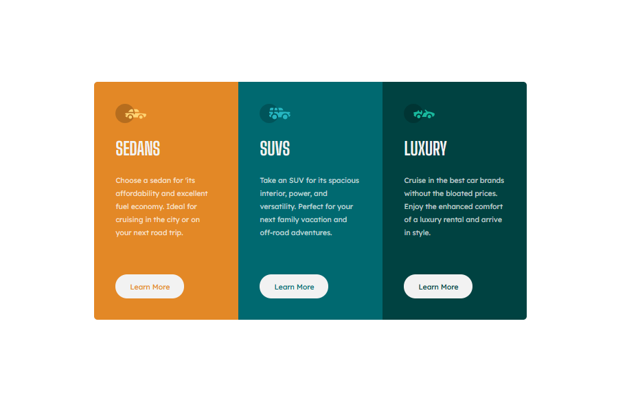

# Frontend Mentor - 3-column preview card component solution

This is a solution to the [3-column preview card component challenge on Frontend Mentor](https://www.frontendmentor.io/challenges/3column-preview-card-component-pH92eAR2-). Frontend Mentor challenges help you improve your coding skills by building realistic projects. 

## Table of contents

- [Overview](#overview)
  - [The challenge](#the-challenge)
  - [Screenshot](#screenshot)
  - [Links](#links)
- [My process](#my-process)
  - [Built with](#built-with)
  - [What I learned](#what-i-learned)
  - [Continued development](#continued-development)
  - [Useful resources](#useful-resources)
- [Author](#author)
- [Acknowledgments](#acknowledgments)

## Overview

### The challenge

Users should be able to:

- View the optimal layout depending on their device's screen size
- See hover states for interactive elements

### Screenshot

### Links

- Solution URL: [Add solution URL here](https://your-solution-url.com)
- Live Site URL: [Add live site URL here](https://your-live-site-url.com)

## My process
-I started with the mobile design first. I used flexbox in column direction to place the cards vertically.
-I then tackled the desktop design. Using flexbox made it very easy to switch the layouts with a media query.
### Built with

- Semantic HTML5 markup
- CSS custom properties
- Flexbox
- Mobile-first workflow

### What I learned

- I faced an issue with the desktop design. My design was overflowing and getting cutoff from the right on medium sized screens. I learnt that it was because I was using max-width: 60%. I got a tip to never use percentage in max-widths, as we don't know what size that will be. Setting max-width using relative units like rem fixed the issue and centered the main component across all screen sizes. It also enabled me to match the reference design.

## Author

- Frontend Mentor - [@riverCodes](https://www.frontendmentor.io/profile/riverCodes)
